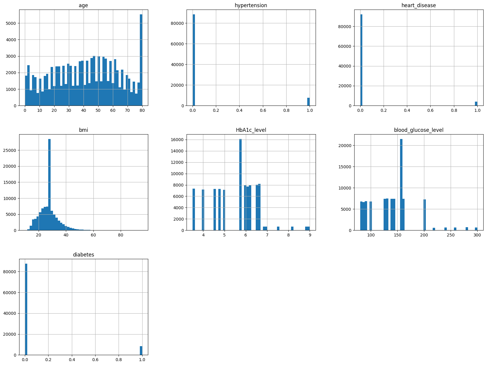
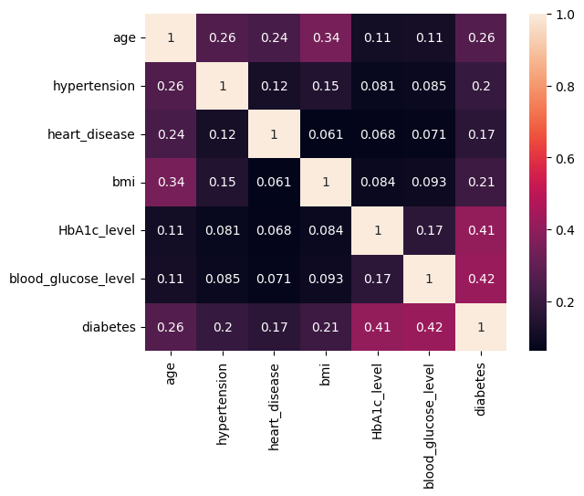
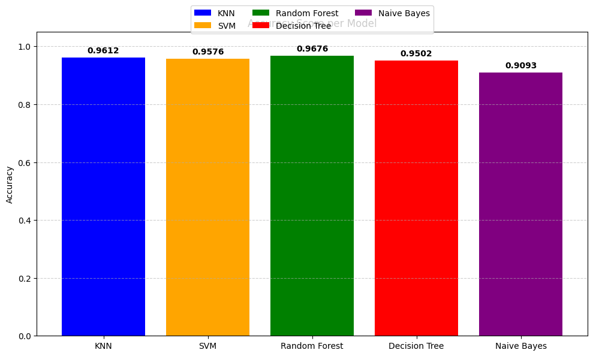

# Laporan Proyek Machine Learning Submission 1- Irwan Syarif Hidayatullah

# Domain Proyek

---

Diabetes merupakan salah satu penyakit kronis paling umum di dunia yang dapat menyebabkan komplikasi serius seperti penyakit jantung, gagal ginjal, gangguan penglihatan, bahkan kematian jika tidak ditangani sejak dini. Menurut World Health Organization (WHO), sekitar 422 juta orang di seluruh dunia menderita diabetes, dan jumlah ini terus meningkat setiap tahunnya [1].

Pendeteksian dini dan intervensi berbasis data dapat membantu mengurangi beban sistem kesehatan dan meningkatkan kualitas hidup pasien. Oleh karena itu, dibutuhkan sistem cerdas berbasis pembelajaran mesin (machine learning) yang mampu memprediksi kemungkinan seseorang mengidap diabetes berdasarkan data klinis dan demografis yang mudah dikumpulkan.

# Business Understanding

---

### Problem Statements

Menjelaskan pernyataan masalah latar belakang:

- Bagaimana memprediksi apakah seseorang berisiko mengidap diabetes berdasarkan data seperti usia, BMI, tekanan darah, dan kadar glukosa darah?

- Dapatkah kita membangun model prediktif yang mampu memprediksi risiko diabetes berdasarkan data sederhana seperti: usia, tekanan darah, glukosa, BMI, dll?

### Goals

- Membangun model klasifikasi yang mampu memprediksi diabetes (ya/tidak) berdasarkan fitur-fitur seperti usia, jenis kelamin, riwayat merokok, tekanan darah, dan kadar HbA1c.

- Menggunakan data medis dasar seperti kadar glukosa, tekanan darah, BMI, usia, dan faktor lainnya sebagai input prediktor.

### Solution statements

- Membuat beberapa model machine learning, diantaranya:
  - Decision tree
  - Random Forest
  - Support Vector Machine (SVM)
  - KNN
  - Naive Bayes
- Menggunakan hypermeter tuning untuk meningkatkan performa akurasi.

# Data Understanding

Jenis | Keterangan
--- | ---
Sumber | [Kaggle](https://www.kaggle.com/datasets/iammustafatz/diabetes-prediction-dataset)
Kategori | Kesehatan
Ukuran File | CSV (3,7MB)

---

### Jumlah Data
Dataset memiliki total 100,000 baris dan 9 kolom, yang terdiri dari 8 fitur dan 1 label target (diabetes).

### Kondisi Data
- Missing Value:
Tidak ditemukan nilai kosong secara eksplisit pada dataset. Namun, pada fitur smoking_history, terdapat nilai Unknown yang berfungsi sebagai kategori tersendiri dan perlu diperlakukan secara khusus.

- Duplikat:
Sudah dilakukan pemeriksaan, terdapat 3854 Duplikat yang ada pada dataset ini.

- Outlier:
Outlier terdeteksi pada kolom bmi dan blood_glucose_level berdasarkan metode Interquartile Range (IQR). Penanganan dilakukan pada tahap data preparatsion.

### Variabel-variabel pada Diabetes Prediction dataset adalah sebagai berikut:

- `gender`: Jenis kelamin
- `age`: Usia
- `hypertension`: Riwayat hipertensi (0 = tidak memiliki riwayat hipertensi, 1 = memiliki riwayat hipertensi)
- `heart_disease`: Riwayat penyakit jantung (0 = tidak memiliki riwayat penyakit jantung, 1 = memiliki riwayat penyakit jantung)
- `smoking_history`: Riwayat merokok
- `bmi`: Body Mass Index
- `HbA1c_level`: Level HbA1c
- `blood_glucose_level`: Kadar glukosa dalam darah
- `diabetes`: Label target (0 = tidak diabetes, 1 = diabetes)

---

## Exploratory Data Analysis (EDA)

Untuk memahami data prediksi diabetes dilakukan analisis eksploratif menggunakan grafik dan visualisasi:

1. Distribusi nilai age, bmi, HbA1c_level, dan blood_glucose_level

> Gambar 3.1 Korelasi umur dengan fitur lainnya

2. Proporsi jumlah penderita diabetes vs tidak
3. Korelasi antar fitur numerik terhadap label diabetes

> Gambar 3.2 Korelasi umur dengan fitur lainnya

# Data Preparation

- **Handling Duplicate**  
  Dilakukan pengecekan data duplikat dan ditemukan data yang sama sebanyak 3854, sehingga dilakukan penghapusan.

- **Handling Categorical Features**  
  Kolom kategori seperti `gender` dan `smoking_history` diolah menggunakan teknik encoding. Teknik ini bertujuan agar data dapat diterima oleh algoritma machine learning yang memerlukan data numerik.

- **Handling Outlier**  
  Penanganan outlier dilakukan menggunakan metode IQR (Interquartile Range). Data yang berada di luar batas bawah dan batas atas dari rentang IQR dibuang agar tidak mengganggu proses pelatihan model, khususnya pada kolom `bmi` dan `blood_glucose_level`.

- **Drop Kolom**  
  Tidak ada kolom yang dihapus karena semua fitur dianggap relevan untuk kebutuhan prediksi.

- **Split Data**  
  Dataset dibagi menjadi data latih dan data uji menggunakan `train_test_split` dengan proporsi 80% untuk pelatihan dan 20% untuk pengujian. Hal ini bertujuan untuk mengevaluasi performa model secara adil pada data yang belum pernah dilihat.

- **Normalisasi Fitur**  
  Normalisasi dilakukan menggunakan [MinMaxScaler](https://scikit-learn.org/stable/modules/generated/sklearn.preprocessing.MinMaxScaler.html) agar seluruh nilai berada dalam rentang 0 hingga 1. Ini penting agar model tidak bias terhadap fitur dengan skala besar.

## Tahap preparation

1. Menangani data kategori (gender, smoking_history) menggunakan teknik encoding.
2. Menormalisasi fitur numerik (age, bmi, dll) untuk memastikan kesetaraan skala.
3. Membagi data menjadi training dan test dengan rasio 80:20.

# Modeling

Model yang digunakan bertujuan untuk memprediksi apakah seorang pasien mengidap diabetes atau tidak berdasarkan fitur-fitur yang tersedia. Berikut adalah penjelasan masing-masing algoritma beserta parameter yang digunakan:

1. **Decision Tree**  
   Algoritma ini membagi data berdasarkan fitur yang paling memberikan informasi (information gain) secara rekursif hingga mencapai keputusan akhir.  
   - Parameter: Menggunakan **default** dari `sklearn.tree.DecisionTreeClassifier`.

2. **K-Nearest Neighbors (KNN)**  
   Model ini mengklasifikasikan data baru berdasarkan label dari K tetangga terdekatnya.  
   - Parameter:
     - `n_neighbors = 5` (default)
     - `metric = 'minkowski'` (default)

3. **Naive Bayes**  
   Berdasarkan Teorema Bayes dengan asumsi bahwa semua fitur saling independen. Cocok digunakan untuk data bersifat kategorikal maupun kontinyu.  
   - Parameter: Menggunakan **default** dari `sklearn.naive_bayes.GaussianNB`.

4. **Random Forest**  
   Merupakan ensemble learning yang menggabungkan banyak pohon keputusan (decision tree) dan melakukan voting terhadap hasilnya.  
   - Parameter:
     - `n_estimators = 100` (default)
     - `criterion = 'gini'` (default)

5. **Support Vector Machine (SVM)**  
   Mencari hyperplane terbaik yang memisahkan dua kelas dengan margin maksimal.  
   - Parameter:
     - `C = 1.0` (default)
     - `kernel = 'rbf'` (default)
     - `gamma = 'scale'` (default)

Setiap model di atas dilatih menggunakan data latih dan dievaluasi menggunakan data uji untuk mengetahui performa klasifikasinya.

# Evaluation

---

Pada tahap modeling ini dibuat beberapa model dengan algoritma yang berbeda-beda. Pada proyek ini akan dibuat 4 model, diantaranya yaitu menggunakan KNN, Random Forest, SVM, Decision Tree dan Naive Bayes.
Setelah melatih keempat model tersebut, didapatkan metriks akurasi sebagai berikut seperti pada diagram di bawah ini.

> Gambar 5.1 Perbandingan Akurasi Model

Dari hasil evaluasi model di atas, didapatkan hasil sebagai berikut:

| Model                    | Akurasi  |
|--------------------------|-------------|
| KNN                      | 0.9612      |
| Decision Tree            | 0.9502       |
| Random Forest            | 0.9676       |
| Support Vector Machine   | 0.9576       |
| Naive Bayes              | 0.9093       |

Dari hasil tersebut dapat diketahui bahwa model dengan algoritma Random Forest memiliki kinerja yang lebih baik. Untuk itu model tersebut yang akan dipilih untuk digunakan.

# Referensi

---

1. World Health Organization (WHO). (2021). Diabetes Fact Sheet. Retrieved from: https://www.who.int/news-room/fact-sheets/detail/diabetes

2. Chaki, J., Ganatra, A., & Pethakar, M. (2019). Machine Learning and Artificial Intelligence Based Diabetes Diagnosis: A Review. In Advances in Computer Vision and Artificial Intelligence. Springer.

3. Kavakiotis, I., Tsave, O., Salifoglou, A., Maglaveras, N., Vlahavas, I., & Chouvarda, I. (2017). Machine Learning and Data Mining Methods in Diabetes Research. Computational and Structural Biotechnology Journal, 15, 104-116. https://doi.org/10.1016/j.csbj.2016.12.005

4. American Diabetes Association. (2022). Standards of Medical Care in Diabetes. Diabetes Care, 45(Supplement_1):S1–S2.
