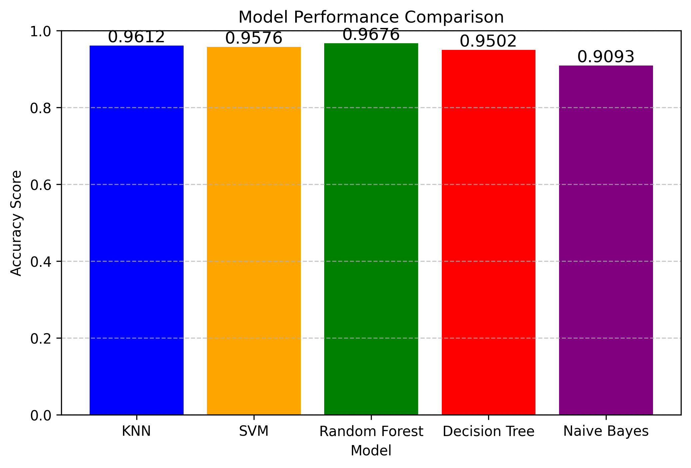

# Laporan Proyek Machine Learning - Nama Anda

# Domain Proyek

---

Diabetes merupakan salah satu penyakit kronis paling umum di dunia yang dapat menyebabkan komplikasi serius seperti penyakit jantung, gagal ginjal, gangguan penglihatan, bahkan kematian jika tidak ditangani sejak dini. Menurut World Health Organization (WHO), sekitar 422 juta orang di seluruh dunia menderita diabetes, dan jumlah ini terus meningkat setiap tahunnya [1].

Pendeteksian dini dan intervensi berbasis data dapat membantu mengurangi beban sistem kesehatan dan meningkatkan kualitas hidup pasien. Oleh karena itu, dibutuhkan sistem cerdas berbasis pembelajaran mesin (machine learning) yang mampu memprediksi kemungkinan seseorang mengidap diabetes berdasarkan data klinis dan demografis yang mudah dikumpulkan.

# Business Understanding

---

### Problem Statements

Menjelaskan pernyataan masalah latar belakang:

- Bagaimana memprediksi apakah seseorang berisiko mengidap diabetes berdasarkan data seperti usia, BMI, tekanan darah, dan kadar glukosa darah?

- Dapatkah kita membangun model prediktif yang akurat dan berguna untuk membantu tenaga medis dalam mendeteksi diabetes secara dini?

### Goals

- Membangun model klasifikasi yang mampu memprediksi diabetes (ya/tidak) berdasarkan fitur-fitur seperti usia, jenis kelamin, riwayat merokok, tekanan darah, dan kadar HbA1c.

- Menyediakan alat bantu keputusan berbasis AI/ML untuk dokter atau penyedia layanan kesehatan guna melakukan skrining awal.

### Solution statements

- Membuat beberapa model machine learning, diantaranya:
  - Decision tree
  - Random Forest
  - Support Vector Machine (SVM)
- Menggunakan hypermeter tuning untuk meningkatkan performa akurasi.

# Data Understanding

Jenis | Keterangan
--- | ---
Sumber | : [Kaggle](https://www.kaggle.com/datasets/iammustafatz/diabetes-prediction-dataset)
Kategori | Kesehatan
Ukuran File | CSV (3,7MB)

---

### Variabel-variabel pada Diabetes Prediction dataset adalah sebagai berikut:

- `gender`: Jenis kelamin
- `age`: Usia
- `hypertension`: Riwayat hipertensi
- `heart_disease`: Riwayat penyakit jantung
- `smoking_history`: Riwayat merokok
- `bmi`: Body Mass Index
- `HbA1c_level`: Level HbA1c
- `blood_glucose_level`: Kadar glukosa dalam darah
- `diabetes`: Label target (0 = tidak diabetes, 1 = diabetes)

---

## Exploratory Data Analysis (EDA)

Untuk memahami data prediksi diabetes dilakukan analisis eksploratif menggunakan grafik dan visualisasi:

1. Distribusi nilai age, bmi, HbA1c_level, dan blood_glucose_level

(./distribution_data.png)
> Gambar 3.1 Korelasi umur dengan fitur lainnya

2. Proporsi jumlah penderita diabetes vs tidak
3. Korelasi antar fitur numerik terhadap label diabetes

(./korelasi antar label.png)
> Gambar 3.2 Korelasi umur dengan fitur lainnya

# Data Preparation

- **Mendeteksi outliers**. Outliers adalah titik data yang berbeda secara signifikan dari pengamatan lainnya sehingga dapat berakibat buruk pada model prediksi. Pada proyek ini menggunakan IQR *(InterQuartile Range)* untuk mendeteksi outliers. IQR dapat menentukan data outliers yang kondisinya di luar batas bawah atau batas atas dari dataset. IQR dapat divisualkan menggunakan boxplot.
- **Split Data** atau pembagian dataset menjadi data latih dan data uji menggunakan bantuan [train_test_split](https://scikit-learn.org/stable/modules/generated/sklearn.model_selection.train_test_split.html). Pembagian dataset ini bertujuan agar nantinya dapat digunakan untuk melatih dan mengevaluasi kinerja model. Pada proyek ini, 80% dataset digunakan untuk melatih model, dan 20% sisanya digunakan untuk mengevaluasi model.
- **Normalisasi**. Pada proyek ini menggunakan [MinMaxScaler](https://scikit-learn.org/stable/modules/generated/sklearn.preprocessing.MinMaxScaler.html), yaitu teknik normalisasi yang mentransformasikan nilai fitur atau variabel ke dalam rentang [0,1] yang berarti bahwa nilai minimum dan maksimum dari fitur/variabel masing-masing adalah 0 dan 1.

## Tahap preparation

1. Menangani data kategori (gender, smoking_history) menggunakan teknik encoding.
2. Menormalisasi fitur numerik (age, bmi, dll) untuk memastikan kesetaraan skala.
3. Membagi data menjadi training dan test dengan rasio 80:20.

# Modeling

---

Algoritma yang digunakan pada model klasifikasi ini adalah sebagai berikut:

1. Decision Tree
   Membagi data berdasarkan fitur yang paling informatif menggunakan struktur pohon. Kelebihan: Mudah diinterpretasi, depat dalam melakukan pelatihan model. Kekurangan: Rentan terhadap overfitting jika tidak dilakukan pengeliminasian.
2. Random Forest
   Menggunakan banyak pohon keputusan dan melakukan voting untuk hasil akhir.
3. Support Vector Machine (SVM)
   Memisahkan kelas hyperplane optimal di ruang vektor tinggi.

# Evaluation

---

Pada tahap modeling ini dibuat beberapa model dengan algoritma yang berbeda-beda. Pada proyek ini akan dibuat 4 model, diantaranya yaitu menggunakan KNN, Random Forest, SVM, Decision Tree dan Naive Bayes.
Setelah melatih keempat model tersebut, didapatkan metriks akurasi sebagai berikut seperti pada diagram di bawah ini.

Dari hasil tersebut dapat diketahui bahwa model dengan algoritma Random Forest memiliki kinerja yang lebih baik. Untuk itu model tersebut yang akan dipilih untuk digunakan.

# Referensi

---

1. World Health Organization (WHO). (2021). Diabetes Fact Sheet. Retrieved from: https://www.who.int/news-room/fact-sheets/detail/diabetes

2. Chaki, J., Ganatra, A., & Pethakar, M. (2019). Machine Learning and Artificial Intelligence Based Diabetes Diagnosis: A Review. In Advances in Computer Vision and Artificial Intelligence. Springer.

3. Kavakiotis, I., Tsave, O., Salifoglou, A., Maglaveras, N., Vlahavas, I., & Chouvarda, I. (2017). Machine Learning and Data Mining Methods in Diabetes Research. Computational and Structural Biotechnology Journal, 15, 104-116. https://doi.org/10.1016/j.csbj.2016.12.005

4. American Diabetes Association. (2022). Standards of Medical Care in Diabetes. Diabetes Care, 45(Supplement_1):S1–S2.
