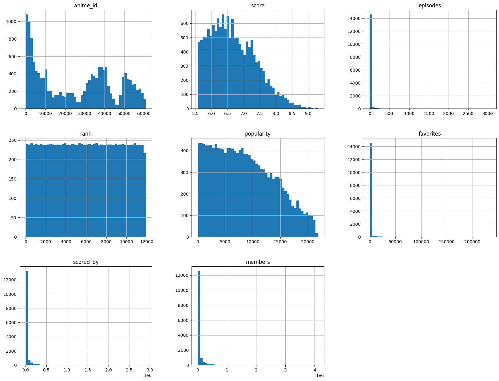

# Laporan Proyek Machine Learning
Ini adalah proyek akhir sistem rekomendasi untuk memenuhi submission dicoding. Proyek ini membangun model berbasis _content based filtering_ yang dapat menentukan top-N rekomendasi anime dan model _K-Nearest Neighbor_.
## Project Overview

Anime, animasi khas Jepang yang digemari banyak orang, kini tersedia di berbagai platform streaming. Namun, banyaknya pilihan anime justru membuat pengguna kesulitan menemukan yang sesuai selera. Penelitian ini mengusulkan sistem rekomendasi untuk mengatasi masalah tersebut.[[1](https://openlibrary.telkomuniversity.ac.id/home/catalog/id/185894/slug/anime-rekomendasi-menggunakan-collaborative-filtering.html)] Sistem ini akan menganalisis riwayat tontonan pengguna, genre favorit, dan rating yang diberikan. Dengan demikian, sistem dapat merekomendasikan anime yang sesuai preferensi masing-masing pengguna. Selain itu, faktor lain seperti popularitas, ulasan pengguna, dan rekomendasi komunitas juga akan dipertimbangkan.[[2](https://repository.uinjkt.ac.id/dspace/bitstream/123456789/45316/1/Ida%20Aisyah.pdf)]
Sistem ini menawarkan keuntungan signifikan bagi pengguna dan penyedia layanan streaming. Pengguna dapat menemukan anime favorit baru, menjelajahi genre baru, dan menemukan anime yang sesuai suasana hati mereka. Sementara bagi perusahaan, sistem ini dapat meningkatkan jumlah penonton, menyediakan konten yang beragam, meningkatkan kepuasan pengguna, dan memahami preferensi pengguna terkait anime yang diinginkan. Singkatnya, sistem rekomendasi dapat menjadi solusi efektif untuk membantu pengguna menemukan anime yang sesuai selera dan meningkatkan pengalaman menonton mereka secara keseluruhan.[[3](https://www.researchgate.net/publication/274712918_Rekomendasi_Anime_dengan_Latent_Semantic_Indexing_Berbasis_Sinopsis_Genre)]

## Business Understanding
Industri anime mengalami pertumbuhan pesat dengan ribuan judul yang dirilis setiap tahunnya. Pengguna seringkali mengalami kesulitan dalam menemukan anime yang sesuai dengan preferensi mereka. Oleh karena itu, sistem rekomendasi sangat dibutuhkan untuk membantu pengguna menemukan tontonan yang relevan secara otomatis dan meningkatkan pengalaman pengguna.
### Problem Statements
- Bagaimana membangun sistem rekomendasi anime berbasis konten yang akurat dan relevan bagi pengguna?
- Fitur-fitur apa yang paling efektif untuk menggambarkan kesamaan antar judul anime?
- Bagaimana cara menggabungkan informasi seperti genre, sinopsis, dan skor menjadi satu representasi teks yang bermakna?
- Bagaimana cosine similarity dapat dimanfaatkan untuk mengukur kemiripan antar anime?

### Goals
Untuk menjawab permasalahan diatas maka dibuatlah sistem rekomendasi dengan tujuan sebagai berikut:

- Mengembangkan sistem rekomendasi anime berbasis content-based filtering yang dapat memberikan saran anime yang relevan sesuai preferensi pengguna.
- Mengidentifikasi dan menggunakan fitur yang paling berpengaruh (seperti genres, synopsis, dan score) untuk mendeskripsikan kemiripan antar anime.
- Membangun fitur gabungan dari data genre, sinopsis, dan skor sebagai representasi teks yang dapat dianalisis dengan metode tekstual.
- Menerapkan algoritma cosine similarity untuk menghitung dan menilai tingkat kemiripan antar anime berdasarkan vektorisasi teks.

### Solution Statements
- Melakukan eksplorasi dan praproses data pada kolom genres, synopsis, dan score.
- Melakukan vektorisasi teks menggunakan TF-IDF untuk representasi numerik.
- Menghitung kemiripan antar anime menggunakan cosine similarity.
- Fungsi Rekomendasi Interaktif
Dibuat fungsi sederhana yang menerima input judul anime dan mengembalikan sepuluh rekomendasi anime paling mirip berdasarkan skor kemiripan tertinggi.
- Evaluasi Kualitatif Hasil Rekomendasi
Sistem diuji dengan contoh kasus (misalnya, judul anime populer seperti Sousou no Frieren) untuk melihat apakah hasil rekomendasi konsisten dari segi genre dan nuansa cerita. 

## Data Understanding
### EDA - Deskripsi Variabel

| Jenis    | Keterangan                                                |
|----------|-----------------------------------------------------------|
| Title    | Top 15,000 Ranked Anime Dataset (Update to 3/2025)                                        |
| Source   |[Kaggle](https://www.kaggle.com/datasets/quanthan/top-15000-ranked-anime-dataset-update-to-32025?select=top_anime_dataset.csv)       |                 
| Ukuran File | CSV (24,31MB)


Berikut informasi pada dataset: Kumpulan dataset ini dikumpulkan dari platform [MyAnimeList](https://myanimelist.net/)  , komunitas online populer dan database untuk penggemar anime dan manga. Platform ini menyediakan informasi berharga tentang acara anime, profil pengguna, dan skor pengguna untuk berbagai anime. Dataset yang digunakan pada proyek kali ini disediakan secara publik di kaggle dengan nama datasets yaitu: _Anime Dataset 2023_ . Dataset ini dapat diunduh di Kaggle : [Top 15,000 Ranked Anime Dataset (Update to 3/2025)](https://www.kaggle.com/datasets/quanthan/top-15000-ranked-anime-dataset-update-to-32025?select=top_anime_dataset.csv) .

### Jumlah Data
Dataset memiliki total 15,000 baris dan 22 kolom, yang terdiri dari 21 fitur dan 1 label target (genres).

### Kondisi Data
- Missing Value:
Ditemukan nilai kosong (NaN) pada beberapa kolom dalam dataset anime. Hal ini terlihat dari hasil anime.isnull().sum() yang menunjukkan jumlah nilai kosong untuk setiap kolom. Beberapa kolom dengan jumlah missing value yang cukup signifikan antara lain:
- `english_name`: 6645 missing values
- `genres`: 1603 missing values
- `synopsis`: 473 missing values
- `episodes`: 115 missing values
- `premiered`: 10314 missing values
- `producers`: 5432 missing values
- `studios`: 2383 missing values
- `rating`: 68 missing values
- `rank`: 3079 missing values
- `type`: 1 missing value
- `japanese_names`: 47 missing values

- Duplikat:
Sudah dilakukan pemeriksaan, terdapat 35 Duplikat yang ada pada dataset ini.


**Berikut informasi pada dataset** :
### Variable - variable pada dataset
Kolom datasets anime memiliki informasi berikut:
- `anime_id`: ID unik buat anime di MyAnimeList (MAL ID).
- `anime_url`: Link ke halaman anime di MyAnimeList.
- `image_url`: Link gambar utama atau cover anime (format JPEG).
- `name`: Judul resmi anime.
- `english_name`: Judul resmi dalam bahasa Inggris (kalau ada).
- `japanese_names`: Judul resmi dalam bahasa Jepang (kalau ada).
- `score`: Nilai rata-rata dari anime di MyAnimeList (skala 1–10, makin tinggi makin bagus).
- `genres`: Daftar genre anime yang dipisah pakai koma (contoh: Action, Comedy, Fantasy).
- `synopsis`: Ringkasan cerita atau sinopsis anime.
- `type`: Jenis anime-nya (contoh: TV, Movie, OVA, ONA, Special, Music).
- `episodes`: Jumlah episode anime-nya (buat yang bentuknya serial TV, OVA, dll).
- `premiered`: Musim dan tahun pertama kali anime ini tayang (contoh: "Fall 2013").
- `producers`: Daftar produser atau studio yang terlibat, dipisah pakai koma.
- `studios`: Studio animasi yang ngerjain anime-nya, juga dipisah pakai koma.
- `source`: Sumber cerita aslinya dari mana (contoh: Manga, Original, Light Novel, Game).
- `duration`: Lama durasi per episodenya (dalam menit).
- `rating`: Rating usia penonton (misalnya: PG-13, R+, G).
- `rank`: Peringkat anime berdasarkan nilai (semakin kecil angkanya, semakin tinggi posisinya). Dataset ini fokus ke 15.000 anime teratas.
- `popularity`: Peringkat popularitas anime di MyAnimeList (semakin kecil angkanya, makin populer).
- `favorites`: Berapa banyak orang yang nge-favoritin anime ini di MyAnimeList.
- `scored_by`: Jumlah orang yang ngasih nilai buat anime ini.
- `members`: Jumlah orang yang masukin anime ini ke daftar mereka di MyAnimeList.




Gambar 1. Distribusi Fitur

## Data Preparation

- **Memilih Kolom yang Relevan**
Memilih kolom-kolom yang akan digunakan untuk analisis dan pemodelan, yaitu anime_id, name, genres, score, type, dan studios. Kolom-kolom lain yang tidak relevan dihapus.

- **Splitting Data Genre**
memisahkan data genre yang awalnya digabung dalam satu kolom dengan pemisah '|'. Setiap genre dipisahkan menjadi baris baru menggunakan fungsi explode().

- **Handling Missing Values**
Dilakukan pengecekan jumlah nilai kosong (missing) pada dataset.
Kolom yang memiliki missing values adalah genres, score, dan studios.
Baris dengan missing values dihapus menggunakan .dropna().

- **Sorting Data:**
Data diurutkan berdasarkan kolom anime_id secara menaik (ascending) menggunakan fungsi sort_values()

- **Handling Duplicate**
Dilakukan pengecekan terhadap data duplikat berdasarkan nama anime (name). Duplikat yang ditemukan dihapus untuk menghindari duplikasi hasil rekomendasi.

- **Mengonversi Data ke List**
Data dari kolom anime_id, name, dan genres dikonversi menjadi bentuk list menggunakan fungsi tolist(). Data ini akan digunakan untuk membangun model rekomendasi.

- **Text Vectorization (TF-IDF)**
Data pada kolom combined_features kemudian diubah menjadi representasi numerik menggunakan teknik TF-IDF (Term Frequency–Inverse Document Frequency). Teknik ini mengukur pentingnya kata dalam dokumen relatif terhadap seluruh dokumen lainnya.


## Modeling 
Pada proyek ini hanya gunakan Model Cosine Similarity. Algoritma ini akan mempelajari kesamaan antar data dalam fitur yang ada.

### Cosine similarity

_Cosine similarity_ adalah metode untuk mengukur seberapa mirip dua vektor dalam ruang multidimensi. Ini adalah pengukuran kosinus sudut antara dua vektor yang dimensi dan magnitudonya direpresentasikan sebagai titik dalam ruang. Nilai similaritas kosinus berkisar antara -1 hingga 1, di mana nilai 1 menunjukkan kedua vektor sepenuhnya sejajar (100% mirip), 0 menunjukkan vektor tegak lurus (tidak ada keterkaitan), dan -1 menunjukkan kedua vektor sepenuhnya berlawanan arah (100% tidak mirip). Metode ini sering digunakan dalam pemrosesan teks dan pengelompokan data untuk menentukan tingkat kesamaan antara dokumen atau fitur dalam dataset. [[5](https://medium.com/geekculture/cosine-similarity-and-cosine-distance-48eed889a5c4)]

Cosine Similarity dituliskan dalam rumus: 

$$Cosine Similarity (A, B) = (A · B) / (||A|| * ||B||)$$ 

dimana: 
- (A·B)menyatakan produk titik dari vektor A dan B.
- ||A|| mewakili norma Euclidean (magnitudo) dari vektor A.
- ||B|| mewakili norma Euclidean (magnitudo) dari vektor B.

Untuk melakukan pengujian model, digunakan potongan kode berikut.
```python
anime_title = 'Sousou no Frieren'
animes[animes.name.eq(anime_title)]
anime_recommendations = anime_recommendations(anime_title)
anime_recommendations
```
| Name                                             | Genres                                                       |
|--------------------------------------------------|--------------------------------------------------------------|
| Strange Dawn	                   |Adventure, Drama, Fantasy.         |
| Kino no Tabi: The Beautiful World - The Animation| Adventure, Drama, Fantasy.          |
| Hikari no Ou                      | Adventure, Drama, Fantasy. |
| Kaze wo Mita Shounen| Adventure, Drama, Fantasy.  |
| Hikari no Ou 2nd Season| Adventure, Drama, Fantasy.   |

Table 1. Hasil Pengujian Model Content Based Filtering (dengan Filter Genres).

Berdasarkan _Table 1. Hasil Pengujian Model Content Based Filtering (dengan Filter Genres)._  Sistem telah berhasil merekomendasikan top 5 persen anime yang mirip dengan **Sousou no Frieren**, yang termasuk beberapa film dan seri dari **Sousou no Frieren** itu sendiri. Ini berarti bahwa jika seorang pengguna menyukai **Sousou no Frieren**, maka sistem dapat memberikan rekomendasi untuk seri atau film lain dalam waralaba **Sousou no Frieren**. Dengan pendekatan ini, sistem mengidentifikasi anime-anime yang memiliki kemiripan dalam genre dengan **Sousou no Frieren**, sehingga memungkinkan pengguna untuk menemukan konten yang sesuai dengan preferensi mereka berdasarkan kesukaan mereka terhadap **Sousou no Frieren**.

Kelebihan _Cosine Similarity_:
- Kompleksitas yang rendah, membuatnya efisien dalam perhitungan.
- Cocok digunakan pada dataset dengan dimensi yang besar karena tidak terpengaruh oleh jumlah dimensi.

Kekurangan _Cosine Similarity_:
- Hanya memperhitungkan arah dari vektor, tanpa memperhitungkan magnitudo (besarnya).
- Perbedaan dalam magnitudo vektor tidak sepenuhnya diperhitungkan, yang berarti nilai-nilai yang sangat berbeda dapat dianggap mirip jika arah vektornya sama.


## Evaluation
Dalam proyek ini, dua metrik evaluasi yang berbeda akan digunakan berdasarkan pada metode pendekatan yang digunakan, yaitu *Precision* untuk pendekatan *Content-Based Filtering*

### Precission
_Precission_ adalah metrik yang penting untuk mengevaluasi kinerja model pengelompokan. Metrik ini membantu dalam memahami seberapa akurat model dalam mengidentifikasi data positif. Nilai presisi yang tinggi menunjukkan bahwa model jarang membuat prediksi positif yang salah, sehingga prediksi positifnya dapat lebih dipercaya.[[7](https://esairina.medium.com/memahami-confusion-matrix-accuracy-precision-recall-specificity-dan-f1-score-610d4f0db7cf)] 

_Precission_ dituliskan dalam rumus:

$$Presisi = \frac{TP}{TP + FP}$$

dimana: 
- TP (True Positive): Jumlah data yang diprediksi positif dan memang benar-benar positif.
- FP (False Positive): Jumlah data yang diprediksi positif, namun kenyataannya adalah negatif.


*Interpretasi* dari hasil presisi berdasarkan _Tabel 1. Hasil Pengujian Model Content Based Filtering (dengan Filter Genres)_. menunjukkan bahwa presisi model rekomendasi Top-5 adalah sempurna, yaitu 5/5 atau 100%. Ini menandakan bahwa model tersebut memberikan rekomendasi dengan tingkat presisi yang sangat tinggi, yakni 100%. Ini sesuai dengan hasil pengujian yang menunjukkan bahwa model mampu memberikan rekomendasi dengan nama dan genre yang mirip dengan anime `Sousou no Frieren`, seperti Adventure, Drama, Fantasy. Hasil rekomendasi menampilkan sepuluh aplikasi dengan genre yang serupa dengan `Sousou no Frieren`.
 
## Referensi
1. Lops, P., de Gemmis, M., & Semeraro, G. (2011). Content-based Recommender Systems: State of the Art and Trends. In F. Ricci, L. Rokach, B. Shapira, & P. B. Kantor (Eds.), Recommender Systems Handbook (pp. 73–105). Springer. Retrieved from: https://www.researchgate.net/publication/226098747_Content-based_Recommender_Systems_State_of_the_Art_and_Trends

2. Ricci, F., Rokach, L., & Shapira, B. (2015). Recommender Systems: Introduction and Challenges. In F. Ricci, L. Rokach, & B. Shapira (Eds.), Recommender Systems Handbook. Springer. Retrieved from: https://www.researchgate.net/publication/294286311_Recommender_Systems_Introduction_and_Challenges

3. Salton, G., & McGill, M. J. (1983). Introduction to Modern Information Retrieval. McGraw-Hill. Retrieved from: https://archive.org/details/introductiontomo00salt